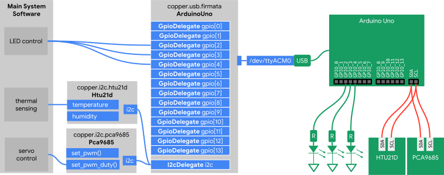

.. _user:

User Guide
==========

This part of the documentation provides information for getting started as
a user of Copper and begins with simple examples.

.. _install:

Installation
------------

From PyPi
^^^^^^^^^

To install Copper, simply run this command in your terminal of choice::

    $ pip install copper

We recommend doing this in a virtual environment or any other Python
sandboxing system you may be using.

From Source Code
^^^^^^^^^^^^^^^^

Copper can be installed from source. This may be useful if you plan on
contributing to Copper::

    $ git clone git://github.com/google/copper/copper.git
    $ pip install -e copper

Once installed, any changes made to that directory will affect future imports
of the Copper module from thereon.

.. _quickstart:

Quickstart
----------

This page will guide you through the process of writing your first code with
Copper. Be sure that Copper is :ref:`installed <install>` and updated to the
latest version. Let's start with some basic examples.

Creating a Diagram
^^^^^^^^^^^^^^^^^^

A good system design start off with a block diagram of major hardware
components and their connectivity with respect to each other.

Notice that the host system is unable to physically communicate directly with
the PCA9685, HTU21D, or the three LED circuits. Instead, the host uses an
Arduino Uno loaded with the StandardFirmata firmware and proxies I²C requests
through an I²C delegate and toggles the LED circuit through GPIO delegates.

Initializing Objects
^^^^^^^^^^^^^^^^^^^^

Begin by importing the module for each unique physical device in the system.
This can be done in a REPL shell environment such as IPython.

.. code-block:: python

    >>> from copper.usb import firmata
    >>> from copper.i2c import pca9685
    >>> from copper.i2c import htu21d

This will import modules containing drivers for Firmata-based USB devices,
the PCA9685 PWM controller, and the HTU21D temperature humidity sensor. We
can now instaniate an object for each hardware device. We'll start with the
Arduino Uno.

All USB devices in Copper are refered to by an identifier unique to each
device. This is typically ``iSerialNumber`` which can be gleaned differently
for each operating system platform. `usbinfo`_ can be used on POSIX systems.
Once the serial number for the Arduino Uno is obtained, we can instantiate
an ``uno`` object as such:

.. code-block:: python

    >>> uno = firmata.ArduinoUno('95530343434351A002E0')
    >>> uno.i2c_enable()

The ``uno`` object now forms a persistent Firmata connection with the Arduino
Uno. The second line initializes the I²C since the Uno is capable of using
the two pins as regular non-I²C GPIOs. The ``i2c`` member is the sole I²C
delegate for this device so the PCA9685 and HTU21D can proxy all I²C traffic
through this member. We first instantiate these two devices. For the PCA9685,
we assign its address to ``0x40`` since the device has been pin-strapped with
that address value.

.. code-block:: python

    >>> servo = pca9685.Pca9685(i2c=uno.i2c, address=0x40)

This assigns the I²C delegate of the ``uno`` object to the PCA9685. Likewise,
we do the same for the HTU21D.

.. code-block:: python

    >>> environ_sensor = htu21d.Htu21d(i2c=uno.i2c)

Interacting with Devices
^^^^^^^^^^^^^^^^^^^^^^^^

Each device will have its own set of methods for getting and setting
properties and performing other functions. For example, the PCA9685 is a
16-channel PWM generator. We can set its frequency to 60Hz and set the
duty cycle for various channels. For example:

.. code-block:: python

    >>> servo.set_pwm_freq(60) # set frequency to 60Hz
    >>> servo.set_pwm_duty(0, 0.5) # set channel 0 to 50% duty

Likewise, the HTU21D temperature and humidity sensor will have its own set
of methods:

.. code-block:: python

    >>> environ_sensor.temperature
    23.4
    >>> environ_sensor.humidity
    42.5

For the example above, the three LEDs can be toggled by calling their GPIO
delegate methods. For example:

.. code-block:: python

    >>> [uno.gpio[idx].read() for idx in range(2, 5)]
    [0, 0, 0]

This indicates that ``GPIO_2``, ``GPIO_3``, and ``GPIO_4`` are all low and
not driving their respective LED. The following will cause each LED to blink
in sequence for a second each.

.. code-block:: python

    >>> while True:
          for i in range(2, 5):
            for j in range(2, 5):
              uno.gpio[j].write(1 if i == j else 0)
            time.sleep(1)

.. _usbinfo: https://usbinfo.readthedocs.io
